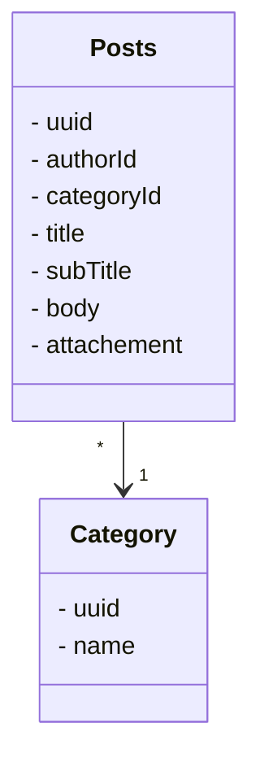

# Regra de negócio categoria

```mermaid
classDiagram
  class Category {
    - uuid
    - name
  }
  class Posts {
    - uuid
    - authorId
    - categoryId
    - title
    - subTitle
    - body
    - attachement
  }


  Posts "*" --> "1" Category
```